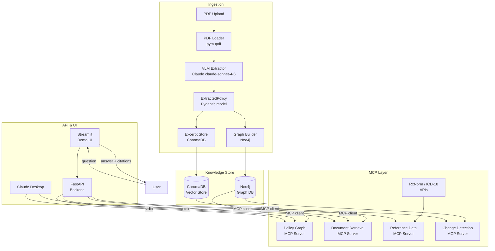

# PolicyLens — Medical Benefit Drug Policy Tracker

> Query and compare drug coverage policies across health insurance payers using
> Vision-Language Models, a knowledge graph, and Model Context Protocol (MCP).

---

## Table of Contents

1. [Overview](#overview)
2. [Architecture](#architecture)
3. [Prerequisites](#prerequisites)
4. [Quick Start](#quick-start)
5. [Configuration](#configuration)
6. [Usage](#usage)
7. [MCP Servers](#mcp-servers)
8. [Example Queries](#example-queries)
9. [Project Structure](#project-structure)
10. [Roadmap](#roadmap)

---

## Overview

Health insurance payers publish hundreds of Medical Benefit Drug Policy PDFs
every year. These documents define which drugs are covered, under what
conditions (prior authorisation, step therapy, quantity limits), and for which
diagnoses. Manually comparing policies across payers — or tracking changes over
time — is error-prone and time-consuming.

**PolicyLens** automates this workflow:

1. **Ingest** — Upload a policy PDF. A Vision-Language Model (Claude) reads
   every page (including scanned tables) and extracts structured data.
2. **Graph** — Extracted entities (drugs, indications, criteria, plans) are
   stored in a Neo4j knowledge graph with rich relationships.
3. **Retrieve** — Raw policy excerpts are indexed in ChromaDB for semantic
   search with page-level citations.
4. **Query** — A Claude agent connects to four MCP servers and answers natural
   language questions with citations and a transparent reasoning trace.

---

## Architecture



---

## Prerequisites

| Requirement | Version |
|-------------|---------|
| Python | 3.11+ |
| Docker + Docker Compose | 24+ |
| Anthropic API key | — |

---

## Quick Start

```bash
# 1. Clone and enter the repo
git clone <repo-url> policy-lens
cd policy-lens/medical-policy-tracker

# 2. Create a virtual environment
python -m venv .venv
source .venv/bin/activate          # Windows: .venv\Scripts\activate

# 3. Install dependencies
pip install -e ".[dev]"

# 4. Copy and fill in the env file
cp .env.example .env
# Edit .env — set ANTHROPIC_API_KEY and NEO4J_PASSWORD at minimum

# 5. Start the databases
docker compose up -d

# 6. Initialise the Neo4j schema (constraints + indexes)
python scripts/init_neo4j.py

# 7. Download sample policies (edit URLs in the script first)
python scripts/download_sample_pdfs.py

# 8. Ingest a policy PDF
python scripts/ingest_policy.py --pdf data/raw_pdfs/sample_aetna.pdf

# 9. Start the API
uvicorn api.main:app --reload

# 10. Start the UI (separate terminal)
streamlit run ui/streamlit_app.py
```

---

## Configuration

All settings are read from environment variables (see `.env.example`).

| Variable | Default | Description |
|----------|---------|-------------|
| `ANTHROPIC_API_KEY` | — | **Required.** Anthropic API key |
| `NEO4J_URI` | `bolt://localhost:7687` | Neo4j Bolt URI |
| `NEO4J_USER` | `neo4j` | Neo4j username |
| `NEO4J_PASSWORD` | — | **Required.** Neo4j password |
| `CHROMA_PERSIST_DIR` | `./data/chroma` | ChromaDB persistence path |
| `VLM_MODEL` | `claude-sonnet-4-6` | Claude model for extraction |
| `LOG_LEVEL` | `INFO` | Logging level |
| `API_HOST` | `0.0.0.0` | FastAPI bind host |
| `API_PORT` | `8000` | FastAPI bind port |

---

## Usage

### Running the API

```bash
uvicorn api.main:app --host 0.0.0.0 --port 8000 --reload
```

Interactive docs at `http://localhost:8000/docs`.

### Running the Streamlit UI

```bash
streamlit run ui/streamlit_app.py
```

Opens at `http://localhost:8501`.

### Running MCP Servers standalone

```bash
# Run any server over stdio (for direct MCP client use)
python scripts/run_mcp_server.py policy_graph
python scripts/run_mcp_server.py document_retrieval
python scripts/run_mcp_server.py reference_data
python scripts/run_mcp_server.py change_detection
```

### Connecting Claude Desktop to the MCP servers

Add the following to your Claude Desktop config (`~/Library/Application Support/Claude/claude_desktop_config.json` on macOS):

```json
{
  "mcpServers": {
    "policy-graph": {
      "command": "python",
      "args": ["/absolute/path/to/scripts/run_mcp_server.py", "policy_graph"],
      "env": {
        "NEO4J_URI": "bolt://localhost:7687",
        "NEO4J_USER": "neo4j",
        "NEO4J_PASSWORD": "changeme"
      }
    },
    "document-retrieval": {
      "command": "python",
      "args": ["/absolute/path/to/scripts/run_mcp_server.py", "document_retrieval"]
    }
  }
}
```

---

## Example Queries

```
"Does Aetna cover pembrolizumab for NSCLC, and what are the prior auth criteria?"

"Compare step therapy requirements for adalimumab between Cigna and UnitedHealthcare."

"Which payers updated their GLP-1 agonist policies in the last 90 days?"

"What ICD-10 codes does Humana accept for dupilumab coverage in atopic dermatitis?"

"Show me all drugs in the anti-VEGF class covered by Anthem's commercial plans."
```

---

## Project Structure

```
medical-policy-tracker/
├── data/                    # PDFs and extracted JSON (gitignored)
├── src/
│   ├── config.py            # Centralised settings (pydantic-settings)
│   ├── models/              # Pydantic data models
│   ├── ingestion/           # PDF loading, VLM extraction, graph building
│   ├── graph/               # Neo4j client, schema, query functions
│   ├── vector_store/        # ChromaDB excerpt store
│   ├── reference/           # RxNorm and ICD-10 API wrappers
│   └── mcp_servers/         # Four MCP servers (stdio transport)
├── api/                     # FastAPI backend
├── ui/                      # Streamlit demo
├── scripts/                 # CLI helpers and one-shot setup scripts
└── tests/                   # pytest test suite
```

---

## Roadmap

- [ ] Stage 1 — Project scaffold *(current)*
- [ ] Stage 2 — Pydantic data models
- [ ] Stage 3 — Neo4j schema, client, init script
- [ ] Stage 4 — VLM extraction module
- [ ] Stage 5 — Graph builder
- [ ] Stage 6 — ChromaDB excerpt store
- [ ] Stage 7 — Reference data (RxNorm / ICD-10)
- [ ] Stage 8 — Four MCP servers
- [ ] Stage 9 — FastAPI backend
- [ ] Stage 10 — Streamlit UI
- [ ] Stage 11 — End-to-end smoke test
- [ ] Automated nightly policy refresh
- [ ] Confidence scoring on VLM extractions
- [ ] Policy change email / Slack alerts
- [ ] Multi-tenant auth for the API

---

*Built with [Claude](https://anthropic.com) · [Neo4j](https://neo4j.com) · [MCP](https://modelcontextprotocol.io)*
